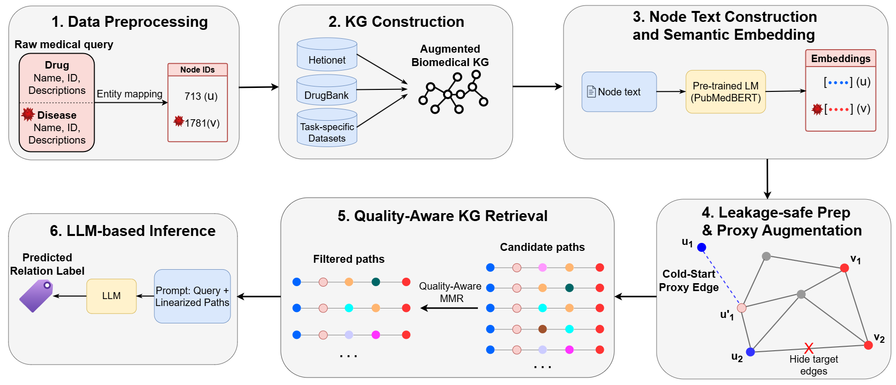

# SemDrug: Quality-Aware Knowledge Graph Retrieval and Semantic Proxy Augmentation for Grounded LLM-Based Drug Repurposing

**SemDrug** is a Knowledge Graph-enhanced Large Language Model (LLM) reasoning framework for inductive biomedical relation prediction. While combining LLMs with Knowledge Graphs (KGs) is a powerful paradigm for biomedical reasoning, its effectiveness depends heavily on the quality and coverage of the retrieved KG evidence. 

SemDrug addresses the *retrieval-quality gap* and *KG coverage gap* by improving the retrieval layer through two core components:
1. **Quality-Aware Semantic Maximal Marginal Relevance (MMR) Path Retrieval**: Scores candidate multi-hop paths by semantic relevance, filters weak paths, and selects diverse evidence to prevent diluting the LLM's context window.
2. **Cold-start Semantic Proxy Augmentation**: Addresses KG coverage limitations by connecting isolated endpoint drugs to semantically similar KG-covered proxies via synthetic edges.

*Fig. 1. Overview of the SemDrug framework: (1) Data Preprocessing maps queries to KG nodes; (2) KG Construction integrates datasets into an augmented KG; (3) Node Text Construction and Semantic Embedding converts node metadata into vectors; (4) Leakage-safe Graph Preparation removes direct edges and applies semantic proxy augmentation; (5) Quality-Aware KG Retrieval extracts and filters multi-hop paths; and (6) LLM-based Inference linearizes paths into textual prompts for zero-shot LLM prediction.*

---

## Supported Tasks

The project currently supports experiments on two primary biomedical benchmarks:

* **PharmacotherapyDB**: drug-disease therapeutic indication prediction
* **DDInter**: drug-drug interaction severity prediction

The main thesis experiments focus on **PharmacotherapyDB** under an inductive drug-disease therapeutic indication prediction setting, and **DDInter** under a cold-start setting.

